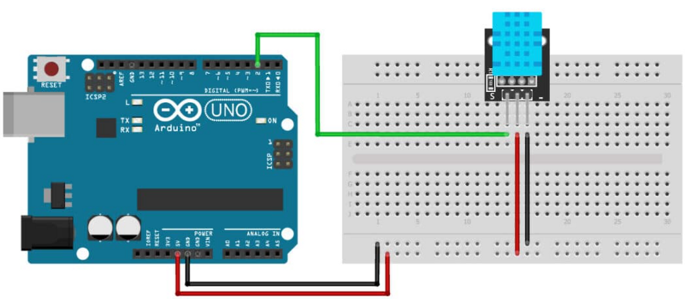

# DHT11 온습도 센서 예제

## 개요

DHT11 센서를 사용하여 온도와 습도를 측정하고, Arduino R4 WiFi의 내장 LED 매트릭스(12x8)에 실시간으로 표시하는 예제입니다.

## 필요한 부품

- Arduino UNO R4 WiFi
- DHT11 온습도 센서
- 점퍼 케이블

## 배선 연결



- DHT11 데이터 핀 → Arduino 디지털 핀 2번
- DHT11 VCC → 5V (브레드보드 +)
- DHT11 GND → GND (브레드보드 -)

## 필요한 라이브러리

Arduino IDE 라이브러리 매니저에서 다음 라이브러리를 설치하세요:

- **DHT sensor library** (by Adafruit)
- **Arduino_LED_Matrix** (내장 라이브러리)

## 코드 설명

### 주요 기능

1. **온습도 측정**: DHT11 센서로 2초마다 온도(°C)와 습도(%)를 읽습니다.
2. **LED 매트릭스 표시**:
   - 왼쪽 절반(y=0~5): 온도 표시
   - 오른쪽 절반(y=6~11): 습도 표시
   - 각 값은 2자리 숫자로 표시 (십의 자리, 일의 자리)
3. **시리얼 모니터 출력**: 측정된 온습도 값을 시리얼 모니터에 출력합니다.

### 핵심 함수

- `clear_frame()`: LED 매트릭스 프레임 버퍼 초기화
- `add_digit_to_frame()`: 특정 위치에 숫자 패턴 추가
- `displayTemperatureHumidity()`: 온도와 습도를 LED 매트릭스에 표시

## 실행 방법

1. Arduino IDE에서 `DT11.ino` 파일을 엽니다.
2. DHT11 센서를 Arduino에 연결합니다.
3. 보드와 포트를 선택합니다 (Tools > Board > Arduino UNO R4 WiFi).
4. 업로드 버튼을 클릭하여 코드를 업로드합니다.
5. 시리얼 모니터를 열어 (115200 baud) 측정 값을 확인합니다.
6. Arduino의 LED 매트릭스에서 온습도가 실시간으로 표시됩니다.

## 예상 출력

시리얼 모니터:
```
DHT11 온습도 센서 + LED 매트릭스 테스트
======================================
----------------------
온도: 23.00 °C
습도: 65.00 %
----------------------
온도: 24.00 °C
습도: 64.00 %
```

LED 매트릭스: 온도(왼쪽) 24, 습도(오른쪽) 64 형태로 표시됩니다.
