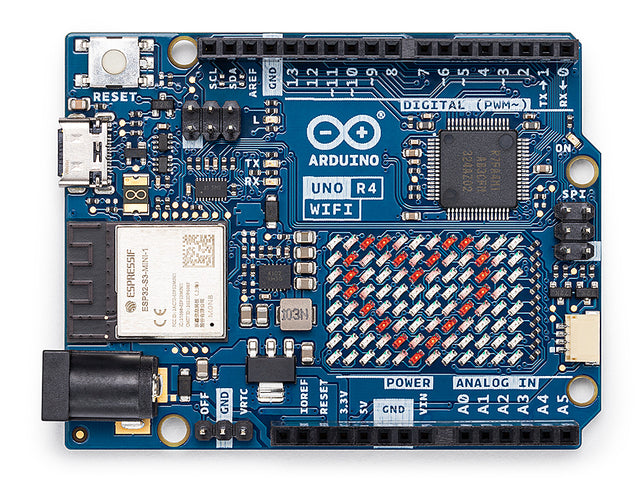
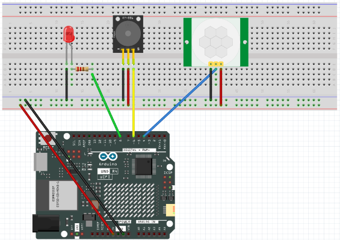
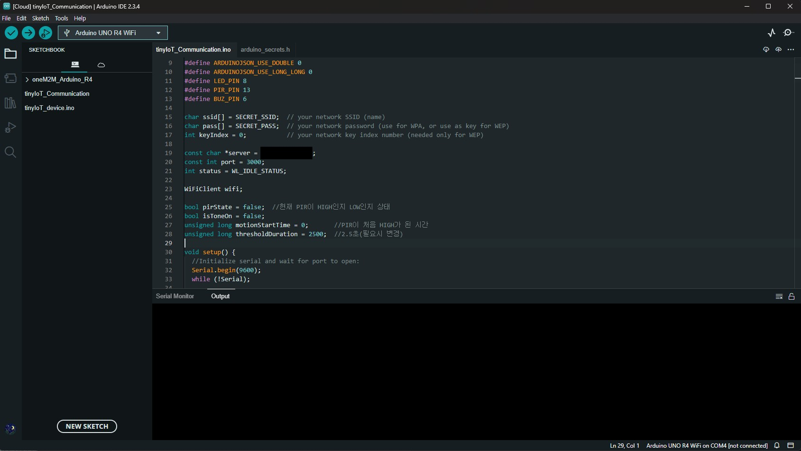
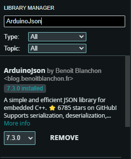
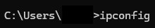
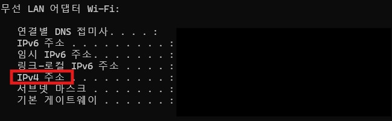

# oneM2M_Arduino-R4_app

[oneM2M](https://www.onem2m.org/) based example of communication between the device and the oneM2M TinyIoT server on the same network using Arduino Uno R4 boards

## Overview

- **Key Feature**: Sensor data collection, data transmission between oneM2M TinyIoT server 
- **Used Board**: Arduino Uno r4 WiFi
- **Development Environment**: Arduino IDE

## Prepartion

1. Install Arduino IDE(at least 1.8.x over)
2. Go to side bar menu and click boards manager in Arduino IDE
3. Type Arduino Uno R4 WiFi in search bar and install board manager
4. Clone this project or download

## How to execute

1. In Arduino IDE by `File > Open`, open `oneM2M_Arduino-R4_app/oneM2M_Arduino_R4.ino` 
2. **Tools > Board** select `Arduino Uno R4 WiFi`  
3. **Tools > Port** select USB port  
4. Click upload button

## Code Configurations
- **Network Configuration**: Attempt to connect wifi according to the WiFi SSID, Password entered
- **Sensor Configuration**: PIR sensor resets itself for 60 seconds
- **oneM2M Structure Setting**: If Arduino can not find its AE in tinyIoT server, the process of creating the AE and then creating the CNTs of each sensor below the AE will be executed
- **Sensor Detection**: If the PIR detects movement for a certain period of time or longer, the LED and Buzzer operate
- **Server Communication**: Send the sensor's value to the server when the PIR operates for a certain period of time or longer, when the LED and Buzzer operate, and when the detection of the PIR ends

## Libraries

- **WiFiS3.h**: Nested Header file in Arduino Uno R4 Boards manager  
- **arduino_secrets.h**: Header file that needs to be created by you. It contains SSID and PASSWORD of your own wifi network
- **ArduinoJson**: Required for json parsing and creation

## Hardware
- **Arduino Uno R4 WiFi**


- **Circuit Configuration**


## Software
- **Arduino IDE**


## User Guide
- **First, define SSID and PASSWORD with your own network name(SSID) and password in arduino_secrets.h**

```c
#define SECRET_SSID "..."
#define SECRET_PASS "..."
```
- **Second, Download latest "ArduinoJson" library using library manager in arduino IDE.**



- **Third, set ip address of server using wireless lan adapter Wi-Fi ipv4 address of your pc.**





```c
const char *server = "Your_ipv4_Address";
```
